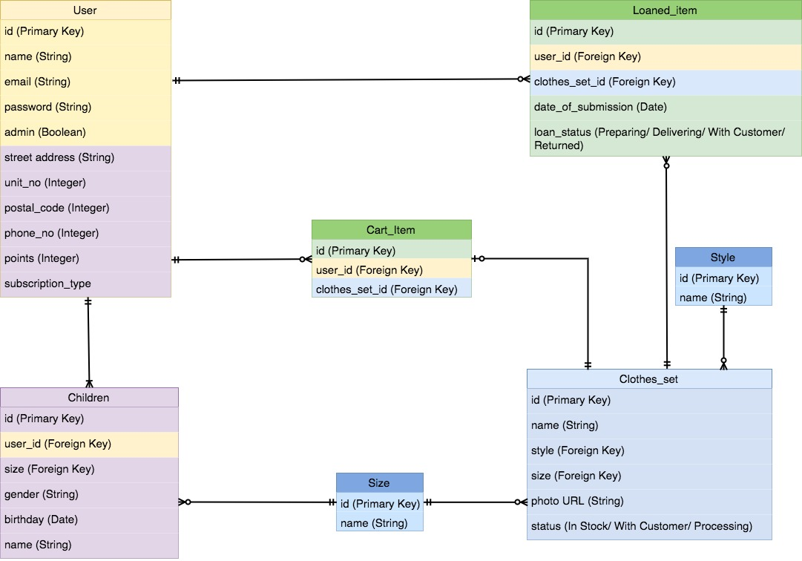
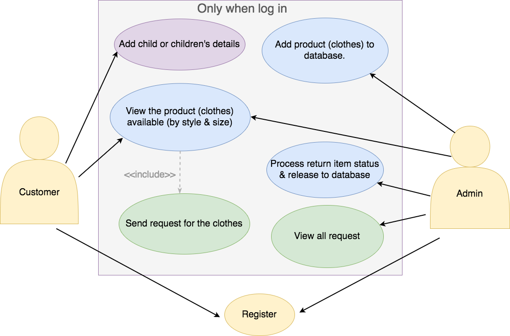

Project 3 - Siya, Hazel, Mingyi 1 TEST
## Project-3 - Siya, Hazel, Mingyi

# README

This README would normally document whatever steps are necessary to get the
application up and running.

Things you may want to cover:

* Ruby version

* System dependencies

* Configuration

* Database creation

* Database initialization

* How to run the test suite

* Services (job queues, cache servers, search engines, etc.)

* Deployment instructions

* ...

## User Story
Users
- Users can register for an account
- Users can login to account
- Users can subscribe / unsubscribe
- Users can add details of children
- Users can update details of children
- Users can choose a new set of clothes to receive every month
- Users have to return old set of clothes every month

Admin
- Admin can register account with secret code
- Admin can login to account
- Admin can view all new monthly requests

## ERD

## Use Case

---

## wireframe
  |  
:------------------------------------------------:|:-------------------------------------------------:
  |  

-------
## routes list
