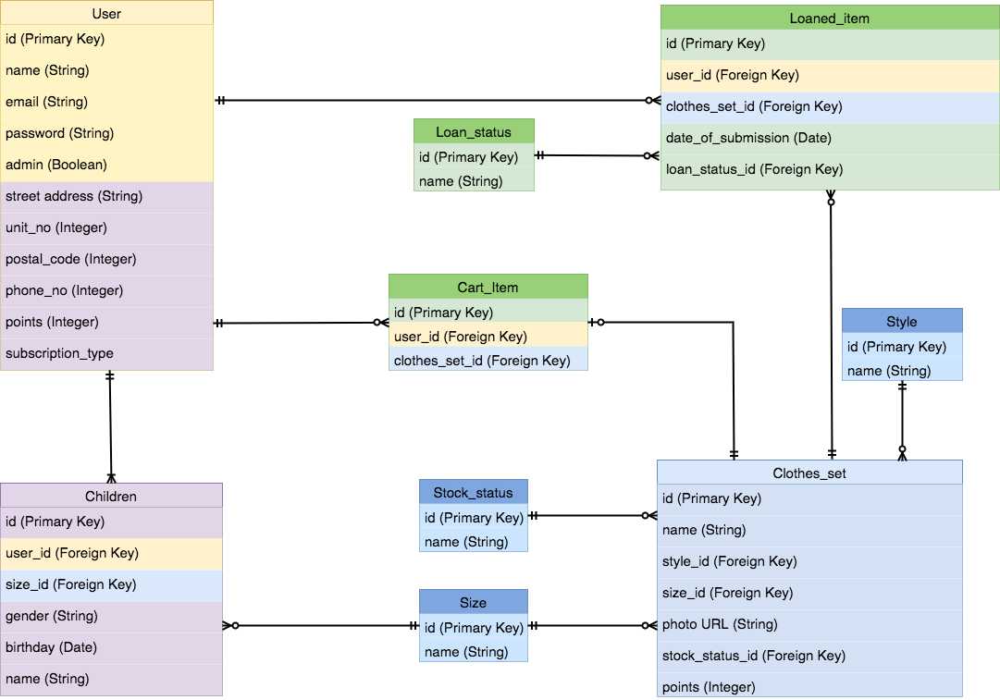
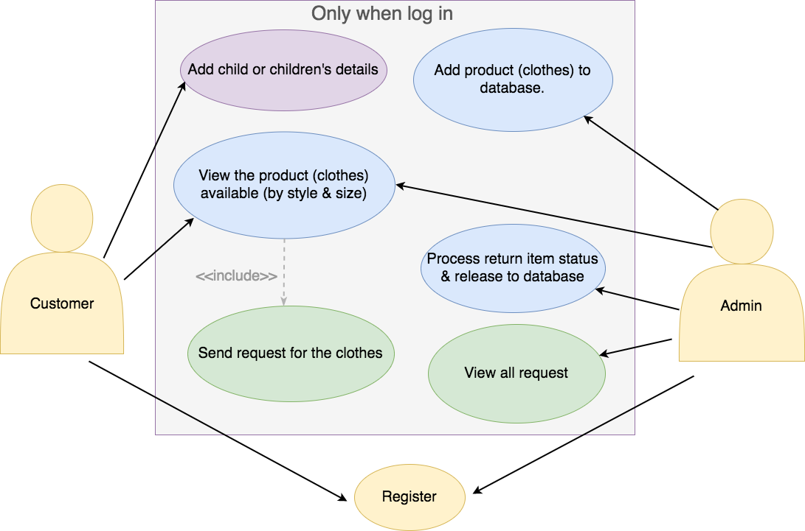

## Project-3 - Siya, Hazel, Mingyi

# README

This README would normally document whatever steps are necessary to get the
application up and running.

Things you may want to cover:

* Ruby version

* System dependencies

* Configuration

* Database creation

* Database initialization

* How to run the test suite

* Services (job queues, cache servers, search engines, etc.)

* Deployment instructions

* ...

## User Story
Users
- Users can register for an account
- Users can login to account
- Users can subscribe / unsubscribe
- Users can add details of children
- Users can update details of children
- Users can choose a new set of clothes to receive every month
- Users have to return old set of clothes every month

Admin
- Admin can register account with secret code
- Admin can login to account
- Admin can view all new monthly requests

## ERD


## Use Case


---

## Wireframe
  |  
:------------------------------------------------:|:-------------------------------------------------:
  |  

-------
## Routes List (to be finalise)

```
/
/register (for register)
/login (for login)
/logout (for logout)
/edit (for edit of user account)
```

to be added

```
/profile (user profile)
/profile/child (to show child's details if user has add the child's information )
/profile/child (to replace /children/add (for adding child's information))

/admin/add_collection (adding clothes_set)
/admin/loaned_item (to view all the loaned_item request that is not settled)
/admin/loaned_item/:id (put, for update loaded_item)
/admin/customer (to view all customer acct)

/collection/:id/add_cart (post: allow for customer to add item to cart)

/children/add (for adding children's information)
```

---------
## Development Log

6 Nov 2017
* Readme added with user stories, use case, ERD and wireframe

7 Nov 2017
* Working home page
* Devise added: allow for user register, login and logout.
* Allow for registration with the necessary information recorded in additional of email and password.
* Edit ERD diagram

8 Nov 2017
* Add model: child, size, loan_status, style, stock_status, clothes_set, cart_item and loaned_item.
* Add migrate files for all models
* Add db seed for loan_status, style, stock_status
* Add controller for children, user are able to create child's details under their account.

9 Nov 2017
* Add profile page to user account.
* Add edit routes for editing children's information
* Edit user_account_update routes from "/edit" to "/profile/edit"
* Edit model : added relationships between models
