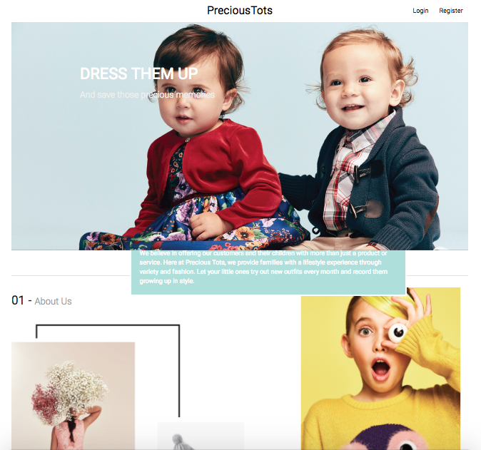

# PreciousTots
Done By: Siya, Hazel, Mingyi <br>



Link To Website: [Precious-tots](https://precious-tots.herokuapp.com)

---

## Design Idea
**Observed Problem:** <br>
Kids grow up too fast. Many parents wish to dress up their kids in pretty cloths but are reluctant to buy new sets due to the fact that they outgrow the clothes in a matter of months.<br><br>
**Proposed Solution:** <br>
We aim to solve this problem by providing a service enabling parents to rent different outfits for their children on a monthly basis.

---

## Table of Contents
1. Web App Design Idea
1. Table of Contents
1. User Story / Use Case
1. ERD
1. Wireframe
1. Routes List
1. Development Log

---

## User Story
#### Users
- can register for an account
- can login to their account
- can subscribe / unsubscribe to monthly plan
- can receive points to their account upon subscription
- can add details of their children
- can update details of their children
- can choose a new set of clothes to receive at the start of every month
  - can view outfits that match their children's size and selected style
  - can add and remove selected outfits to their shopping cart
  - can checkout their shopping cart to start the processing
- have to return previously rented outfits when they receive newly requested ones

#### Admins
- can add new admins
- can login to admin site
- can view / edit all users in database
- can view / edit all user outfit requests
- can view / edit all clothes in database
- can add new clothes into database

#### Use Case


## ERD


---

## Wireframe
  |  
:------------------------------------------------:|:-------------------------------------------------:
  |  

---
## Routes List (to be finalized)

```
/
/register (for register)
/login (for login)
/logout (for logout)
/edit (for edit of user account)
```

to be added

```
/profile (user profile)
/profile/child (to show child's details if user has add the child's information )
/profile/child (to replace /children/add (for adding child's information))

/admin/add_collection (adding clothes_set)
/admin/loaned_item (to view all the loaned_item request that is not settled)
/admin/loaned_item/:id (put, for update loaded_item)
/admin/customer (to view all customer acct)

/collection/:id/add_cart (post: allow for customer to add item to cart)

/children/add (for adding children's information)
```

---

## Development Log

6 Nov 2017
* Add README with user stories, use case, ERD and wireframe

7 Nov 2017
* Add working home page
* Add Devise: allow for user register, login and logout
* Add registration feature. Allow for registration with the necessary information recorded i.e. email and password
* Edit ERD diagram

8 Nov 2017
* Add models: child, size, loan_status, style, stock_status, clothes_set, cart_item and loaned_item
* Add migrate files for all models
* Add db seed for loan_status, style, stock_status
* Add controllers for children. Users are able to create child's details under their account.

9 Nov 2017
* Add profile page to user account
* Add edit routes for editing children's information
* Edit user_account_update routes from "/edit" to "/profile/edit"
* Edit models: added relationships between models

10 Nov 2017
* Add edit & delete routes for child
* Add necessary gem files
* Add browse function

12 Nov 2017
* Add cart function: able to add item to cart, remove and checkout cart
* Add admin function: admin able to add other admin account, admin able to see all the loaned item and edit it

13 Nov 2017
* Add filter clothes function: able to filter clothes by size & style
* Edit cart function: add AJAX cart function
* Fix: double creation of cart_items
* Improve CSS

14 Nove 2017
* Update user registration required field
* Redirect to 'add child' on user register
* Redirect to 'filter form' on child information added
* Edit default values for style/size selection
* Browse page display current user points, ajax: +/- points on add/remove cart item.

15 Nov 2017
* Add AJAX to in-cart quantity, add/remove button for clothes browsing
* Add Stripe payment system
* Edit user registration > add child > payment > filter form > browse page > cart > checkout > my orders route
* Improve CSS
* Push to Heroku
* Soft launch
* Edit README

<!-- ## README

This README would normally document whatever steps are necessary to get the
application up and running.

Things you may want to cover:

* Ruby version

* System dependencies

* Configuration

* Database creation

* Database initialization

* How to run the test suite

* Services (job queues, cache servers, search engines, etc.)

* Deployment instructions

* ... -->
